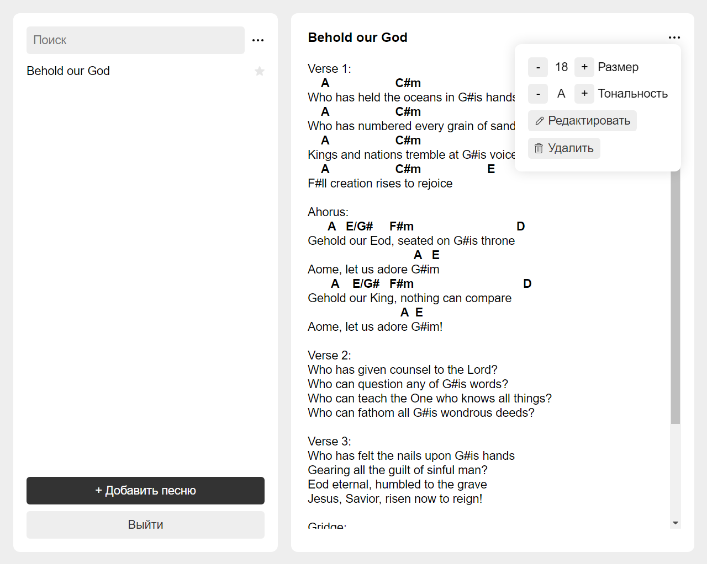
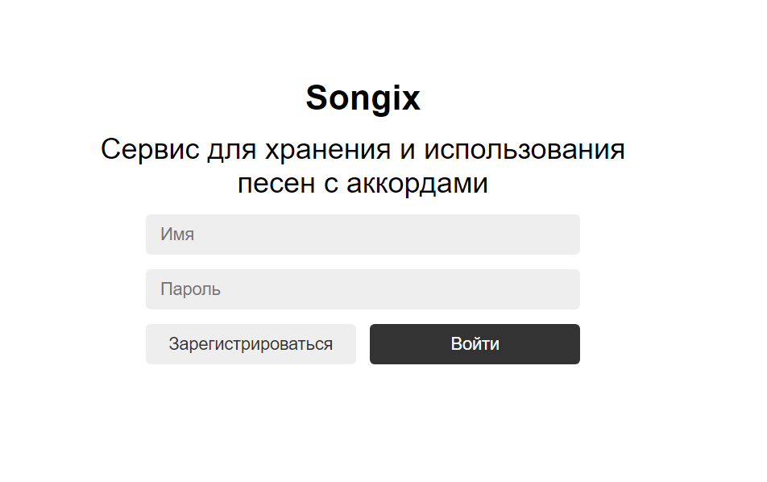

# Songix

### Description
Songix is a service for music groups and solo artists, where they can store their entire repertoire, as well as play it during a performance.




### Features
- Registration/Login/Exiting the web application
- Adding/Editing/Deleting a song
- Filtering songs by search/category
- Adding a song to favorites/ View your favorite songs
- Increasing the size of the song text
- Transposing the chords of a song

### Installation
Open the console
```bash
cd frontend // Navigate to the frontend directory
npm install // Install dependencies
npm build // Build an app
cd ../backend // Navigate to the backend directory
npm install // Install dependencies
```

Add the file 'config.js' to the backend directory
```javascript
module.exports = {
  PORT: 5000,
  JWT_TOKEN_KEY: 'secret-token-key',
  DB_CONECT: 'mongodb-connection',
}
```
Open the console
```bash
npm run dev // Run the development server
```

### Tech Stack Frontend
- React
- React Router
- React Contenteditable

### Tech Stack Backend
- NodeJS (Express)
- MongoDB (Mongoose)
- JsonWebToken
- Bcrypt